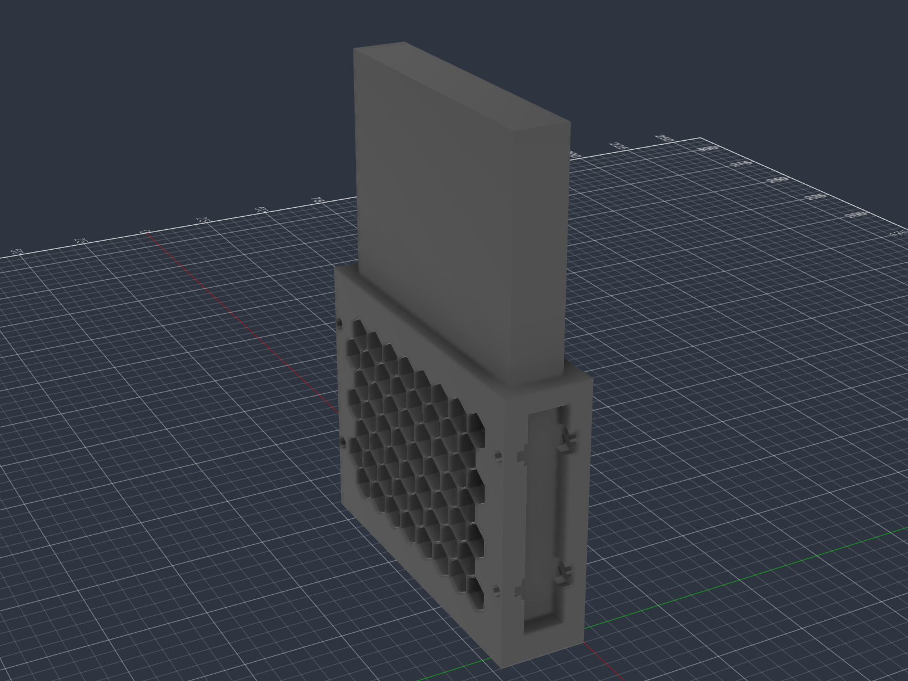
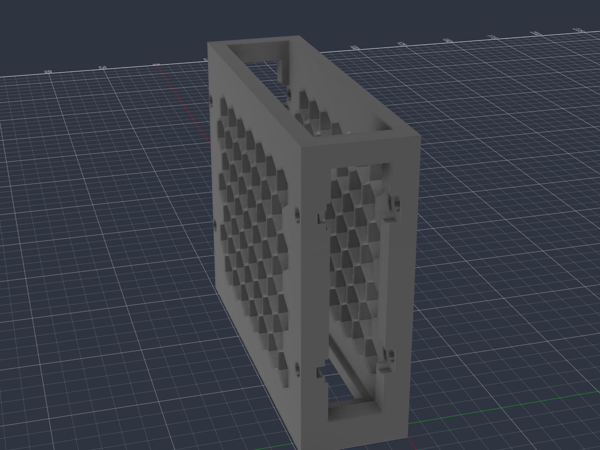
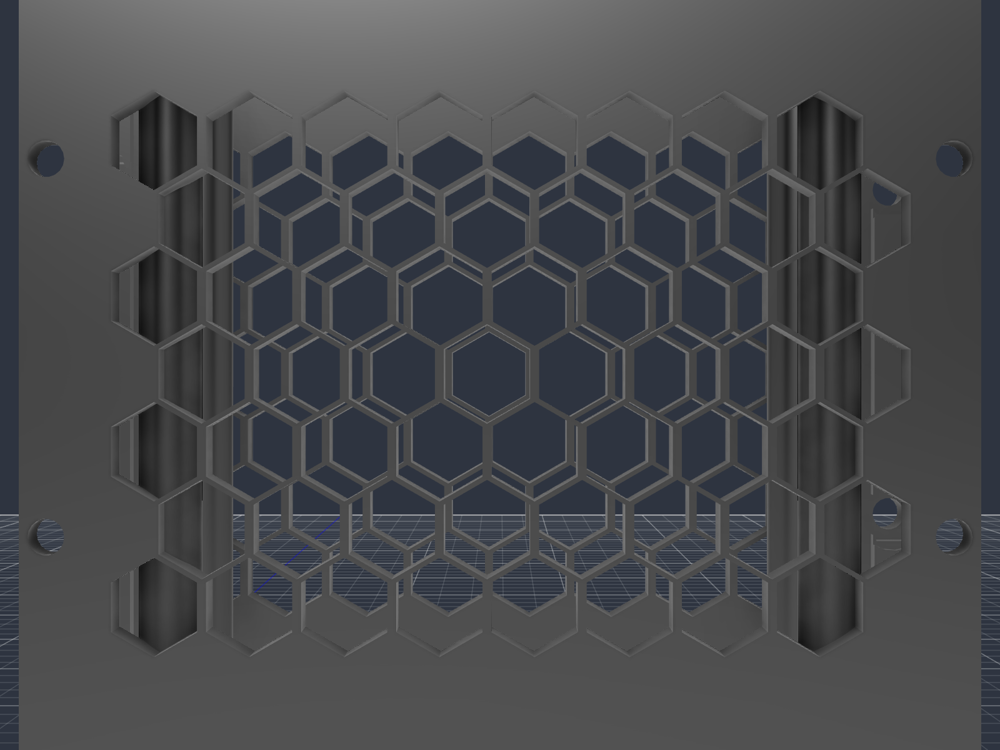
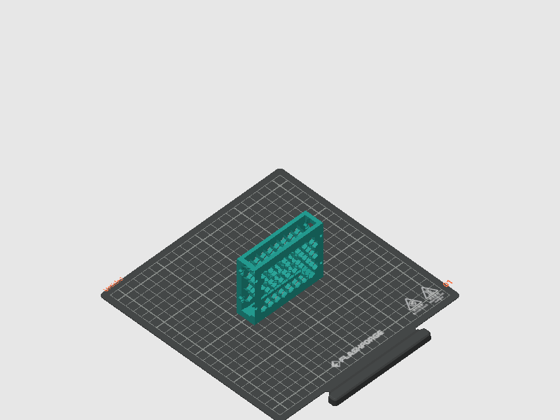

# Modular Single-Bay HDD / SSD Caddy (70mm Tall, +10mm Ventilation, Split Guide Pins)

A modular, linkable 3D-printable dock tailored specifically for **$78\text{ mm} \times 14\text{ mm}$ external hard drive / SSD enclosures**, featuring an expanded **$+10\text{ mm}$ ventilation clearance** with **4 internal split cylinder guide pins (7 mm bottom + 7 mm top)** that rigidly constrain the drive while maximizing airflow and reducing print time and plastic consumption.

| Hard Drive Enclosure in Dock (+5mm Air Gap) | 4 Cylinder Pins Inside Bay | 100% Flat Mating Exterior |
| :---: | :---: | :---: |
|  |  |  |

---

## Key Features

1. **+10 mm Ventilation Expansion with Split Guide Pins (7 mm Bottom + 7 mm Top):**
   - **Total Slot Width:** Expanded from $14.8\text{ mm}$ to **$24.8\text{ mm}$** (+10 mm) for unrestricted airflow.
   - **Split Cylinder Guide Pins ($\varnothing 6.0\text{ mm}$):**
     - **Bottom Pins:** $7.0\text{ mm}$ tall rising from the floor ($Z = 3.5\text{ mm}$ to $10.5\text{ mm}$) to locate and seat the base of the drive.
     - **Top Pins:** $7.0\text{ mm}$ tall at the top rim ($Z = 63.0\text{ mm}$ to $70.0\text{ mm}$) to guide drive entry and prevent top wobble.
     - **Open Midsection:** The entire middle $52.5\text{ mm}$ is completely open air, cutting print time down to **1h 18m** and filament down to **36.5 g**.
   - **Zero-Wobble Drive Constraint:** The inner tangent distance between the left and right pins is precisely **$14.8\text{ mm}$** ($0.4\text{ mm}$ clearance on each side of the $14.0\text{ mm}$ drive).
   - **Generous 5.0 mm Air Gap on Both Sides:** Rather than resting flush against the honeycomb walls, the drive is held centered with a continuous **$5.0\text{ mm}$ air gap on each side**, allowing massive cross-ventilation across both large aluminium/plastic drive surfaces.

2. **Internal Fastening System (Inside Washer & Nut Recesses):**
   - **Screw Head & Washer Seat (Left Pillar):** $\varnothing 7.5\text{ mm}$ circular counterbore ($2.5\text{ mm}$ deep) on the **inside** face of the pillar ($Y = 6.0\text{ mm}$). Fits standard DIN 125 M3 washers ($\varnothing 7.0\text{ mm}$) and socket/button head screws completely flush inside the vertical window opening.
   - **Captive Hex Nut Pocket (Right Pillar):** $5.6\text{ mm}$ across flats ($2.6\text{ mm}$ deep) with washer recess ($0.8\text{ mm}$ deep) on the **inside** face ($Y = 26.8\text{ mm}$).
   - **100% Flat Exterior Mating Faces:** Both outside walls ($Y = 0$ and $Y = 32.8\text{ mm}$) have **zero counterbores** — only clean $\varnothing 3.4\text{ mm}$ through-holes. When modules are joined side-by-side, their exterior walls mate completely flush with zero gap.
   - **Internal Assembly:** All screws, washers, and nuts are inserted and tightened from **inside** each bay.

3. **Optimized Cross-Ventilation:**
   - Full-height isometric honeycomb lattice (7 rows, 38 mm cell diagonal) on both large side walls for passive cross-ventilation.
   - Bottom chimney through-floor vent ($63.0 \times 20.8\text{ mm}$) for natural convective vertical airflow.

---

## Dimensions Summary

| Parameter | Drive Size | Internal Slot / Pins | External Footprint | Clearance / Tolerance |
| :--- | :---: | :---: | :---: | :--- |
| **Length (X axis)** | **$78.0\text{ mm}$** | **$79.0\text{ mm}$** | **$89.0\text{ mm}$** | $+0.5\text{ mm}$ per end ($1.0\text{ mm}$ total) for smooth insertion |
| **Width / Depth (Y axis)** | **$14.0\text{ mm}$** | **$24.8\text{ mm}$ slot**<br>($14.8\text{ mm}$ between pins) | **$32.8\text{ mm}$** | $+0.4\text{ mm}$ per side between pins; **$5.0\text{ mm}$ air gap** to each wall |
| **Height (Z axis)** | ~125 mm | Open top | **$70.0\text{ mm}$** | High lateral stability |
| **Side Wall Thickness** | — | — | **$4.0\text{ mm}$** | Solid perimeters (4 wall loops) |
| **Floor Thickness** | — | — | **$3.5\text{ mm}$** | Rigid base with chimney vent |
| **Guide Pins** | — | **$4 \times \varnothing 6.0\text{ mm}$ (Split)** | — | **$7.0\text{ mm}$ bottom** + **$7.0\text{ mm}$ top** |
| **Mounting Levels** | — | — | **$Z = 20\text{ mm}$, $Z = 55\text{ mm}$** | Dual screw rigidity |

---

## Multi-Bay Stacking Guide

Modules are daisy-chained side-by-side:

```
       [Bay 1]                  [Bay 2]
+--------------------+   +--------------------+
|  (Inside Bay 1)    |   |  (Inside Bay 2)    |
|                    |   |                    |
|  [Screw + Washer]  |   |    [M3 Hex Nut]    |
|         |          |   |          ^         |
|         +==========>===>==========+         |
|         4mm wall   |   |   4mm wall         |
+--------------------+   +--------------------+
     Flat Mating Joint: 8mm total solid plastic
```

1. Align the flat right exterior wall of Bay 1 with the flat left exterior wall of Bay 2.
2. From **inside Bay 1**, pass an M3 screw with an M3 washer through the inside counterbore.
3. In **inside Bay 2**, thread the screw into the captive M3 hex nut.
4. Tighten with a hex key from inside Bay 1. Both screw head and nut are recessed flush inside the respective window frames, leaving the drive pocket completely clear!

---

## Bill of Materials (BOM) per Joint

To connect two adjacent bays:
- **$2 \times$ M3 Screws:** M3 $\times 12\text{ mm}$ or M3 $\times 14\text{ mm}$ (Socket head DIN 912 or Button head ISO 7380)
- **$2 \times$ M3 Washers:** DIN 125A ($\varnothing 7.0\text{ mm}$ OD, $0.5\text{ mm}$ thickness)
- **$2 \times$ M3 Hex Nuts:** DIN 934 ($5.5\text{ mm}$ across flats)

---

## Slicer & Print Guidelines



- **Printer:** Flashforge Adventurer 5M Pro / Bambu Lab / Prusa (or any FDM printer)
- **Nozzle:** $0.4\text{ mm}$
- **Layer Height:** $0.20\text{ mm}$
- **Wall Loops:** **4** (ensures 100% solid perimeters through the 4.0 mm walls, guide pins, and around screw holes)
- **Top / Bottom Shells:** 4 layers
- **Infill:** $15\text{--}20\%$ Gyroid
- **Supports:** **None required** (honeycombs, vertical pins, and bridges are 100% self-supporting)
- **Print Time:** ~1h 36m
- **Filament Consumption:** ~43.2 g

---

## Change Tracking in Git (Code-CAD)

Binary 3D models (`.stl`, `.3mf`, `.f3d`) cannot be diffed cleanly in Git. This repository provides text-based parametric models that allow full **Git change tracking**:

1. **OpenSCAD (`cad/modular_single_bay_70mm.scad`):**
   - Pure text-based CSG script.
   - All dimensions (`drive_w`, `drive_t`, `slot_l`, `slot_t`, `caddy_h`, `pin_r`, etc.) are declared as parametric variables at the top of the file.
   - Any modification will produce clear, line-by-line `git diff` outputs.
2. **Fusion 360 Python Generator (`cad/generate_fusion360_model.py`):**
   - Standalone Python script for the Fusion 360 API.
   - Fully parametric generation, appearance assignment, and automated export to STL.
3. **Fusion MCP Client (`cad/fusion_client.py`):**
   - Lightweight JSON-RPC client to execute scripts and export models directly via Fusion 360 MCP.

---

---

## Print Monitoring & Web Dashboard

This repository includes real-time telemetry tools to monitor Flashforge Adventurer 5M series printers via TCP socket (port 8899) and live MJPEG chamber camera stream (port 8080).

### 1. CLI Monitor (`print_status.py`)
Quick command-line tool for checking temperatures, layer count, file, and progress:
```bash
python print_status.py          # One-time status snapshot
python print_status.py --watch  # Auto-refreshing terminal HUD (every 5s)
```

### 2. Real-Time Web Dashboard (`app/`)
A responsive dark-themed dashboard containerized with Docker and deployed to `kopilka:4000`:
- **Live Chamber Camera Feed:** Embedded low-latency MJPEG stream with real-time XYZ toolhead coordinate overlay.
- **WebSocket Telemetry:** Zero-latency updates for Nozzle & Bed temperatures (actual vs. target), layer progress (`Layer X / Y`), elapsed time, and extruded filament length (A).
- **Printer Controls:** Remote chamber LED light toggle (`~M651` / `~M652`) and Pause / Resume controls (`~M25` / `~M24`).
- **Stream Recording & Archive:** Direct server-side recording of the camera feed into compressed H.264 MP4 clips via FFmpeg, with a built-in gallery for downloads and management.
- **Access:** Available on local network at `http://kopilka:4000/`.

To run locally or deploy:
```bash
cd app
docker compose up -d --build
```

---

## Repository Structure

```
.
├── app/                                  # Real-time web telemetry dashboard
│   ├── Dockerfile
│   ├── docker-compose.yml
│   ├── main.py                           # FastAPI + WebSocket backend & camera proxy
│   ├── requirements.txt
│   └── templates/
│       └── index.html                    # Dark-mode dashboard with Tailwind CSS
├── cad/
│   ├── modular_single_bay_70mm.scad      # Parametric OpenSCAD source with 4 guide pins
│   ├── generate_fusion360_model.py       # Parametric Fusion 360 API generator
│   └── fusion_client.py                  # Direct JSON-RPC client for Fusion MCP
├── models/
│   └── Modular_SingleBay_70mm_Tight.stl  # Production STL model (89.0 x 32.8 x 70.0 mm)
├── gcode/
│   └── Modular_SingleBay_70mm_Tight.gcode # Print-ready G-code (Adventurer 5M Pro)
├── images/                               # 3D viewport renders and slicer plate preview
├── legacy/                               # Previous prototype iterations and test models
├── Modular_SingleBay_16mm_M3.3mf         # OrcaSlicer active project file
├── print_status.py                       # CLI printer telemetry script
├── .gitignore
└── README.md
```
